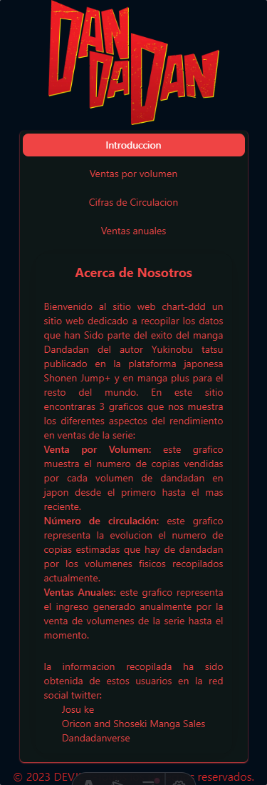
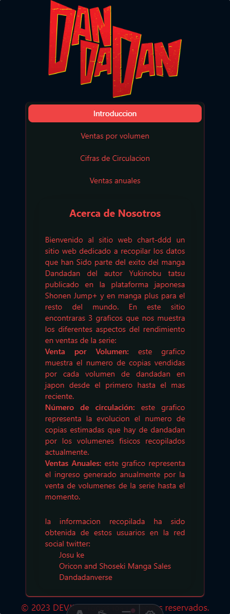
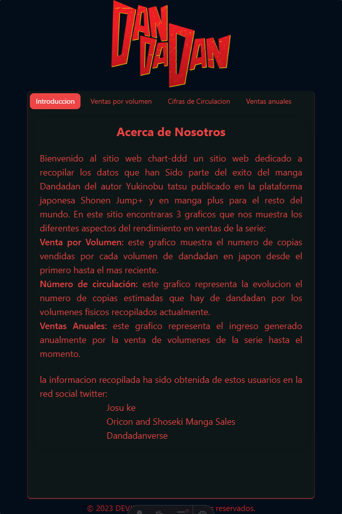
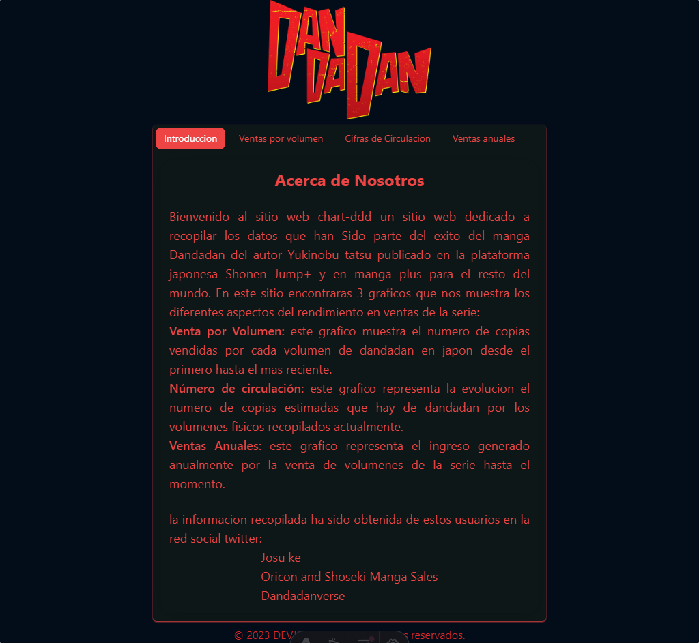

# Chart-DDD 👻👽

Chart-DDD es un sitio web que muestra una infografía sobre el manga de Dandadan del autor yukinobu tatsu (ex asistente de chainsaw man y hell's paradise). la pagina contiene 3 diagramas que ilustran las ventas por volumen, el número de circulación y las ventas anuales del manga. desde su publicacion en 2021.

## Tecnologias Utilizadas

Para crear este sitio web se han utilizado las siguientes tecnologías:

- Astro JS: un framework de JavaScript que permite construir sitios web estáticos y dinámicos con componentes modernos.
- Tailwind CSS: un framework de CSS que ofrece clases de utilidad para diseñar la interfaz de usuario sin escribir CSS personalizado.
- NextUI: una librería de componentes de React que ofrece elementos de interfaz de usuario elegantes y accesibles.
- React JS: una librería de JavaScript para crear interfaces de usuario interactivas y reactivas.
- React Chart JS: una librería de gráficos para React basada en Chart.js.

## Capturas de Pantalla
aqui se muestra las en las diferentes vistas de la pagina web
 
 
 

## Licencia
Este proyecto está bajo la licencia MIT. Consulta el archivo LICENSE.md para más detalles.

## Autoría
Este proyecto ha sido creado por Jhon Alexander Luna Gonzalez. Puedes seguirme en <tu-red-social>.
